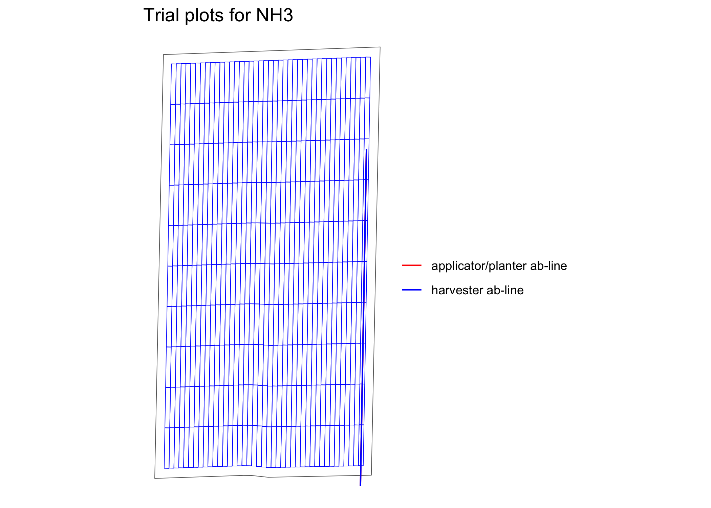
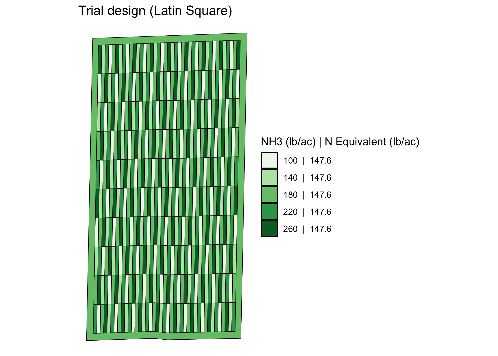

<!-- README.md is generated from README.Rmd. Please edit that file -->

# ofpetrial: Design on-Farm Precision Experiments

<!-- badges: start -->

[](https://github.com/DIFM-Brain/ofpetrial/actions/workflows/R-CMD-check.yaml)
<!-- badges: end -->

The `ofpetrial` package allows the user to design agronomic input
experiments in a reproducible manner without using ArcGIS or QGIS. The
[vignette](https://difm-brain.github.io/ofpetrial/) for this package
provides more detailed guidance on how to use the package.

## Installation

### CRAN version

You can install the CRAN version of the `ofpetrial` package.

``` r
install.packages("ofpetrial")
```

### Development version

You can install the development version of ofpetrial from
[Github](https://github.com/DIFM-Brain/ofpetrial):

``` r
devtools::install_github("DIFM-Brain/ofpetrial")
```

## Example

Here, we demonstrate how to use the `ofpetrial` package to create a
single-input on-farm experiment trial design (more detailed instructions
on the basic workflow is provided in [this
article](https://difm-brain.github.io/ofpetrial/articles/V0-basic-work-flow.html)).

``` r
library(ofpetrial)
```

### Create experimental plots

We start with specifying plot and machine information for inputs using
`prep_plot`.

``` r
n_plot_info <-
  prep_plot(
    input_name = "NH3",
    unit_system = "imperial",
    machine_width = 30,
    section_num = 1,
    harvester_width = 30,
    plot_width = 30
  )
#> 
```

Now, we can create experiment plots based on them using
`make_exp_plots()`.

``` r
exp_data <-
  make_exp_plots(
    input_plot_info = n_plot_info,
    boundary_data = system.file("extdata", "boundary-simple1.shp", package = "ofpetrial"),
    abline_data = system.file("extdata", "ab-line-simple1.shp", package = "ofpetrial"),
    abline_type = "free"
  )

viz(exp_data, type = "layout", abline = TRUE)
```



### Assign rates

We first prepare nitrogen rates.

``` r
#!===========================================================
# ! Assign rates
# !===========================================================
n_rate_info <-
  prep_rate(
    plot_info = n_plot_info,
    gc_rate = 180,
    unit = "lb",
    rates = c(100, 140, 180, 220, 260),
    design_type = "ls",
    rank_seq_ws = c(5, 4, 3, 2, 1)
  )

dplyr::glimpse(n_rate_info)
#> Rows: 1
#> Columns: 12
#> $ input_name          <chr> "NH3"
#> $ design_type         <chr> "ls"
#> $ gc_rate             <dbl> 180
#> $ unit                <chr> "lb"
#> $ tgt_rate_original   <list> <100, 140, 180, 220, 260>
#> $ tgt_rate_equiv      <list> <82.0, 114.8, 147.6, 180.4, 213.2>
#> $ min_rate            <lgl> NA
#> $ max_rate            <lgl> NA
#> $ num_rates           <int> 5
#> $ rank_seq_ws         <list> <5, 4, 3, 2, 1>
#> $ rank_seq_as         <list> <NULL>
#> $ rate_jump_threshold <lgl> NA
```

We can now use `assign_rates()` to assign rates to experiment plots.

``` r
trial_design <- assign_rates(exp_data, rate_info = n_rate_info)
```

Here is the visualization of the trial design done by `viz`.

``` r
viz(trial_design)
```



Along with the spatial pattern of the input rates, the
applicator/planter ab-line and harvester ab-line are drawn by default.

### Write the trial design files for implementation

You can write out the trial design as a shape file.

``` r
write_trial_files(td)
```

# Acknowledgement

This project was funded in part by a United States Department of
Agriculture—National Institute of Food and Agriculture (USDA—NIFA) Food
Security Program Grant (Award Number 2016-68004-24769) and by United
States Department of Agriculture (USDA) -Natural Resources Conservation
Service (NRCS), Commodity Credit Corporation (CCC), Conservation
Innovation Grants On-Farm Conservation Innovation Trials (Award Number
USDA-NRCS-NHQ-CIGOFT-20-GEN0010750).
